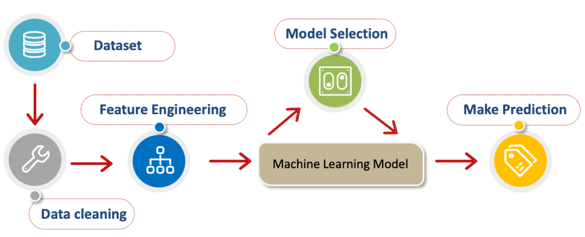
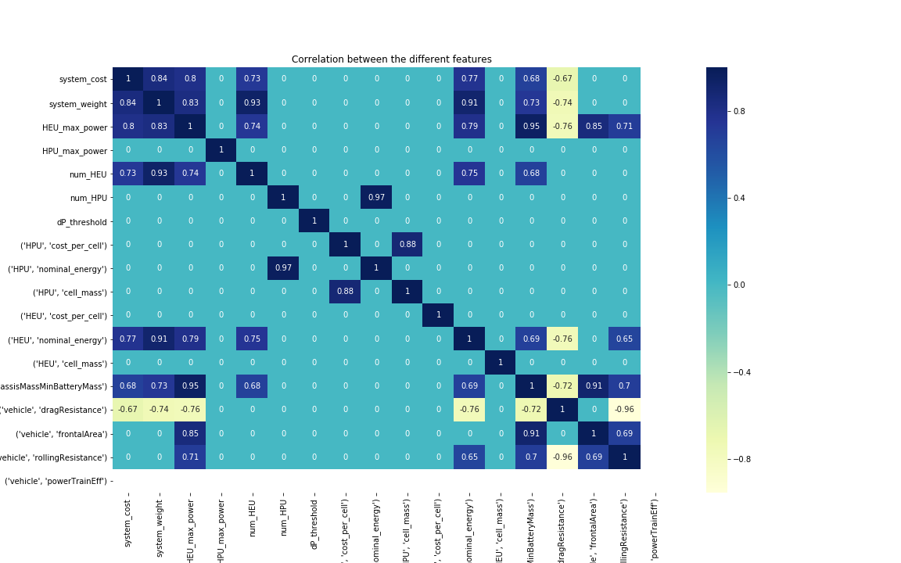

# electra-vehicle-range-prediction

This is course data science project coop with [Electra Vehicles](https://www.electravehicles.com/)

Team member:
- Min Zhou(minzhou@bu.edu)
- Yuchen Wang(wangyc95@bu.edu)
- Xinqiao Wei(weixq95@bu.edu)

Electra Vehicles Inc:
- Thomas Couture(tcouture@electravehicles.com)
- Fabrizio Martini(fmartini@electravehicles.com )
- Jake Berliner(jberliner@electravehicles.com )

# Objectives:
Considering the specifications of the energy storage system, the vehicle mod- eling parameters, and the simulated vehicle operating conditions, our goal is to project the resultant simulated vehicle range without performing a detailed cycle analysis. The resulting models will be generated for each of the supplied EPA driving cycles, and will account for any possible simulated vehicle or energy storage system. As vehicle range is a nonlinear factor, as opposed to system cost, system power, and system range, such a calculation would serve to bet- ter estimate all core energy storage system specifications prior to performing a detailed electrochemical analysis.

# Dataset:
The dataset we are using for this project is provided by Electra Vehicle, which contains 680 JSON files in total and each JSON file documented a use case with system specification (specs and numbers of HPU and HEU), the power distribution and the specs of the vehicle using for testing. More data will be imported if necessary.

# System Disgram:


# Methods:
We approach the solution by using Decision Tree, Random Forest, Support Vector Regression and K-Nearest Neighbors, and Linear regression algorithms to train different models. Multiple models are compared and we selected the most robust trained models to predict the vehicle range, and compared them based on MAE, MSE and R-squre Score.

# Input and Output:
## Input variables
HEU and HPU specifications:
- system_cost
- system_weight
- num_HEU
- num_HPU
- HEU_nominal_energy
- HPU_nominal_energy
- HEU_cost (cost per cell)
- HPU_cost (cost per cell)
- HEU_weight (cell_mass)
- HPU_weight (cell_mass)
- HEU_max_power
- HPU_max_power
- dP_threshold

vehicle input variables:

- chassis_Mass_Min_Battery_Mass
- drag_Resistance
- frontal_area
- rolling_resistance
- power_Train_Eff

## Output
* system_range

# Results:

## 1. Correlation of features:
Only showing the absolute coefficients above 0.65, otherwise 0. 


## 2. Significant features:

After analyzing the confidence intervals and significance, we got 6 important features:
- system_cost
- system_weight
- dP_threshold
- HEU_cost_per_cell
- HEU_nominal_energy
- vehicle_chassisMassMinBatteryMass


## 3. OLS Linear Regression Model with significant features:
```
                            OLS Regression Results                            
==============================================================================
Dep. Variable:                      y   R-squared:                       0.992
Model:                            OLS   Adj. R-squared:                  0.992
Method:                 Least Squares   F-statistic:                     5625.
Date:                Thu, 06 Dec 2018   Prob (F-statistic):          4.66e-291
Time:                        14:38:26   Log-Likelihood:                -1325.4
No. Observations:                 289   AIC:                             2663.
Df Residuals:                     283   BIC:                             2685.
Df Model:                           6                                         
Covariance Type:            nonrobust                                         
==============================================================================
                 coef    std err          t      P>|t|      [0.025      0.975]
------------------------------------------------------------------------------
x1            -0.0099      0.001     -9.795      0.000      -0.012      -0.008
x2             0.5694      0.050     11.431      0.000       0.471       0.667
x3             1.1555      0.251      4.602      0.000       0.661       1.650
x4            84.4159      2.206     38.266      0.000      80.074      88.758
x5             4.9403      0.329     15.001      0.000       4.292       5.589
x6            -0.1070      0.005    -23.602      0.000      -0.116      -0.098
==============================================================================
Omnibus:                       82.593   Durbin-Watson:                   2.029
Prob(Omnibus):                  0.000   Jarque-Bera (JB):              756.990
Skew:                          -0.857   Prob(JB):                    4.19e-165
Kurtosis:                      10.741   Cond. No.                     1.27e+04
==============================================================================

Warnings:
[1] Standard Errors assume that the covariance matrix of the errors is correctly specified.
[2] The condition number is large, 1.27e+04. This might indicate that there are
strong multicollinearity or other numerical problems.
```

## 4. Other Machine Learning Model and Results.


## API sample output:
```
$ python vehicle_prediction.py 
Please put the JSON file to "new_data" folder.

Select the model:
1. RandomForest 2. KNN 3. DecisionTree 4.OLS
1

Enter the number of JSON files you would like to predict: 3
rf_model.sav loaded!

JSON file path saved.
new_data/110782058312546990342664573987452969510_5900.0_60.0_0.4000000000000001
new_data/110782058312546990342664573987452969510_5900.0_60.0_0.2
new_data/110782058312546990342664573987452969510_5900.0_60.0_0.5000000000000001

Successfully read the JSON file.

Successfully extracted the 14 features, and the input shape: (3, 14).

The predicted system range is 363.1661751390961.

The predicted system range is 363.22721869907997.

The predicted system range is 363.0744924921793.
```