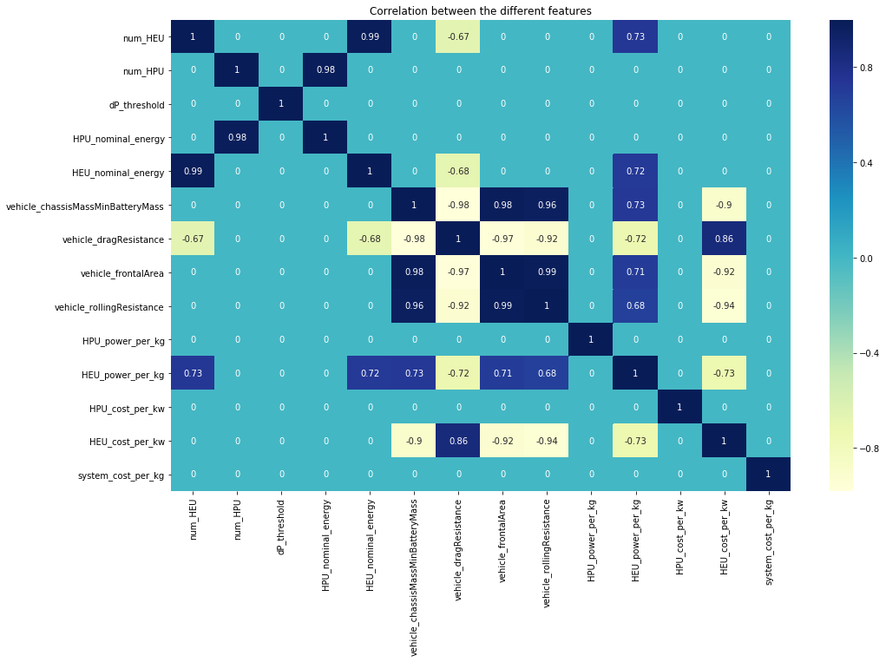

# electra-vehicle-range-prediction

This is course data science project coop with [Electra Vehicles](https://www.electravehicles.com/)

Team member:
- Min Zhou(minzhou@bu.edu)
- Yuchen Wang(wangyc95@bu.edu)
- Xinqiao Wei(weixq95@bu.edu)

Electra Vehicles Inc:
- Thomas Couture(tcouture@electravehicles.com)
- Fabrizio Martini(fmartini@electravehicles.com )
- Jake Berliner(jberliner@electravehicles.com )

[Our poster](https://github.com/minzhou1003/electra-vehicle-range-prediction/blob/master/docs/eletra_poster.pdf)
[Final Report](https://github.com/minzhou1003/electra-vehicle-range-prediction/blob/master/docs/electra_final_report.pdf)


# File Instructions:
- `vehicle_range_prediction.ipynb` is the Jupyter Notebook for developing models
- `vehicle_prediction.py` is the python script of prediction API
- `trained_models` folder contains all trained models
- `new_data` folder contains sample input JSON files
- `figs` folder contains some useful images
- `docs` folder contains [poster](https://github.com/minzhou1003/electra-vehicle-range-prediction/blob/master/docs/eletra_poster.pdf) and final report.


# Introduction:
Electra Vehicles, Inc. is an innovative Boston-based startup developing and designing intelligent control software for energy storage systems. What sets Electra Vehicles apart is the ability to design and control dual chemistry systems through our Ai-based control algorithms. Electra was one of the top-26 teams at the MassChallenge startup incubator in 2016 and is a part of the Massachusetts Clean Energy Center's AccelerateMass program to support the adoption of innovative clean technology in Massachusetts. In this project, we are working with Electra Vehicles on predicting electric vehicle range from provided system specifications. The vehicle range is defined as how far can you drive on a full charge. However, there are uncertainties that make this difficult.

# Objectives:
Considering the specifications of the energy storage system, the vehicle modeling parameters, and the simulated vehicle operating conditions, our goal is to project the resultant simulated vehicle range without performing a detailed cycle analysis. The resulting models will be generated for each of the supplied EPA driving cycles, and will account for any possible simulated vehicle or energy storage system. As vehicle range is a nonlinear factor, as opposed to system cost, system power, and system range, such a calculation would serve to better estimate all core energy storage system specifications prior to performing a detailed electrochemical analysis.

# Dataset:
The raw dataset is collected from Amazon S3 Buckets in JSON format provided by Electra Vehicles. We transformed 20,000 JSON files to Pandas DataFrame and split the dataset into 13,400 training examples and 6,600 test examples to train and evaluate our model.

# System Disgram:


# Methods:
We approach the solution by using Random Forest, Decision Tree, K-Nearest Neighbors Regression, and Ordinary Least Squares algorithms to train 4 different regression models. The trained models are used to predict the vehicle range given the specific input, and we compared them using commonly used regression evaluation metrics: MAE (Mean Absolute Error), MSE (Mean Squared Error) and R-Squared Score. 

# Input and Output:
## Input variables
- num_HEU,
- num_HPU,
- dP_threshold,
- system_range,
- HPU_nominal_energy,
- HEU_nominal_energy,
- vehicle_chassisMassMinBatteryMass,
- vehicle_dragResistance,
- vehicle_frontalArea,
- vehicle_rollingResistance,
- HPU_power_per_kg,
- HEU_power_per_kg,
- HPU_cost_per_kw,
- HEU_cost_per_kw,
- system_cost_per_kg

## Output
* system_range

# Results:

## 1. Correlation of features:
Only showing the absolute coefficients above 0.65, otherwise 0. 


## 2. Significant features:

By using statistical methods, we compared the importance of each feature as follows:


We also presented the top 12 feature distributions respects to system range:


## 4. Model Perfomance Comparison:


## 3. OLS Linear Regression Model
The partial regression visulization:


# Vehicle Prediction API:
## Installation:
```
git clone https://github.com/minzhou1003/electra-vehicle-range-prediction.git
cd electra-vehicle-range-prediction
python vehicle_prediction.py
```

## API sample output:
```
$ python vehicle_prediction.py 
Please put the JSON file to "new_data" folder.

Select the model:
1. RandomForest 2. KNN 3. DecisionTree 4.OLS
1

Enter the number of JSON files you would like to predict: 3
rf_model.sav loaded!

JSON file path saved.
new_data/110782058312546990342664573987452969510_5900.0_60.0_0.4000000000000001
new_data/110782058312546990342664573987452969510_5900.0_60.0_0.2
new_data/110782058312546990342664573987452969510_5900.0_60.0_0.5000000000000001

Successfully read the JSON file.

Successfully extracted the 14 features, and the input shape: (3, 14).

The predicted system range is 363.1661751390961.

The predicted system range is 363.22721869907997.

The predicted system range is 363.0744924921793.
```
